 # BYPASS THE ADVERSARY’S 2FA WITH EVILGINX.
 ## Made by : EL BACHARI Mohamed
 ## Only for educational purpose.
### I.INTRODUCTION

To enhance security and prevent password theft, many applications now use two-factor authentication (2FA). This method requires users to verify their identity in two ways: first, by entering their username and password (one-factor authentication), and second, by using an additional method such as receiving a one-time password (OTP) on an authenticated device like a phone (two-factor authentication). This added layer of security makes it significantly harder for hackers to gain unauthorized access to accounts such as Microsoft365, Facebook, and Linkedin…

Often, the quickest and simplest method to breach systems is through social engineering, rather than developing complex exploits for weak accounts. Major hacking groups, including the Sandworm and Lazarus Group (a top North Korean hacking organization), frequently use social engineering to infiltrate difficult systems. In fact, I experience daily social engineering attempts from North Korean hackers. It's crucial not to underestimate social engineering, as nearly 80% of successful hacks involve this tactic.
In this tutorial, we will explore how Evilginx can assist in obtaining credentials and help us bypass the 2FA of a reel Microsoft 365 account and finally fully compromise the account so it become ours.
 ### II.What is EVILGINX
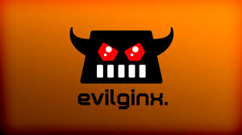
Evilginx is an attack framework for setting up phishing pages. Instead of serving templates of sign-in pages lookalikes, Evilginx becomes a relay between the real website and the phished user. Phished user interacts with the real website, while Evilginx captures all the data being transmitted between the two parties.

Evilginx, being the man-in-the-middle, captures not only usernames and passwords, but also captures authentication tokens sent as cookies. Captured authentication tokens allow the attacker to bypass any form of 2FA enabled on user's account
If you are wondering why and how , evilginx has a reverse proxy that do all the work for us so for example after you click on the link provided by the attacker ,you wiil be send to the real website (for example to the real facebook.com)

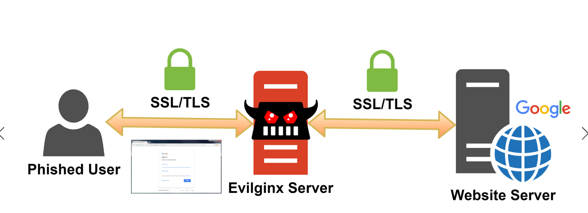

After each successful login, website generates an authentication token for the user's session. This token (or multiple tokens) is sent to the web browser as a cookie and is saved for future use. From that point, every request sent from the browser to the website will contain that session token, sent as a cookie. This is how websites recognize authenticated users after successful authentication. They do not ask users to log in, every time when page is reloaded.

This session token cookie is pure gold for the attacker. If you export cookies from your browser and import them into a different browser, on a different computer, in a different country, you will be authorized and get full access to the account, without being asked for usernames, passwords or 2FA tokens.

 ### III.HACKING MICROSOFT 365 now
 
---

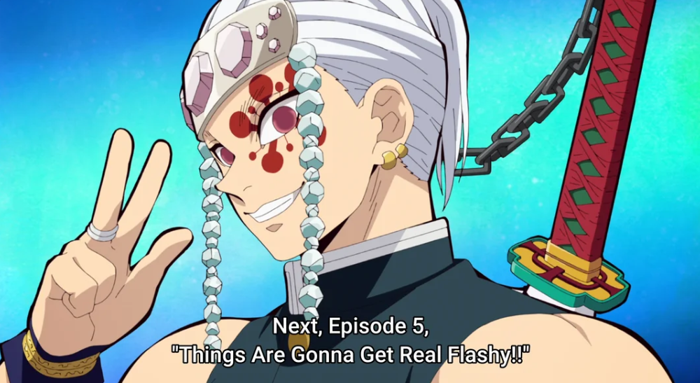
---

Things are gonna Get Flashy

 #### 1.INSTALLATION in kali-linux
Like every new tool in your kali , you only need to clone the repository using commands such as  git clone 
Repo link : https://github.com/kgretzky/evilginx2

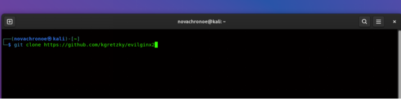

after clonning the repository, cd to it and then you will find your self in a lot of directories and files, hahahaha don’t panic for now the only two directories you need to know are build and phishlets

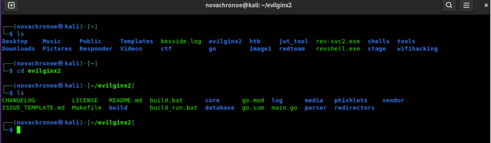

 #### 2.PREPARE YOUR PHISHLET.
Phishlets are new site configs. They are plain-text ruleset files, in YAML format, which are fed into the Evilginx engine. Phishlets define which subdomains are needed to properly proxy a specific website, what strings should be replaced in relayed packets and which cookies should be captured, to properly take over the victim's account. There is one phishlet for each phished website. You can deploy as many phishlets as you want, with each phishlet set up for a different website. Phishlets can be enabled and disabled as you please and at any point Evilginx can be running and managing any number of them.

For script kiddies, you dont have to write your own phishlet , specially if you want to phish websites like facebook or linkedin, their phishlets are already made by other people and you will find them on github

So for the microsoft 365 phishlet that I used you will find it in this github repo 
https://github.com/faelsfernandes/evilginx3-phishlets/blob/main/o365-mfa.yaml
I recommand that you copy the YAML  and paste it in a file.yaml in the phishlets directory showed before.

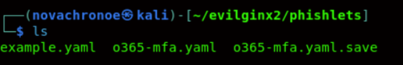

NB: if you want to know more about phishlets and start making your own, first things first. I advise you to get familiar with YAML syntax to avoid any errors when editing or creating your own phishlets.

Sometimes for the phishlet to work properly and to not interrupt the phished user's experience, it needs to redirect the user's browser right after session tokens are successfully captured.

 #### 3. Deployment Time.
Finally we set up everything , now we are gonna start our tool  and enjoy the hacking using the evilginx-tool

NB: for more of educational purpose , I’m gonna only deploy evilginx locally , if you want to perform real attacks , I don’t want to be the personne to lead you .
Starting tool:

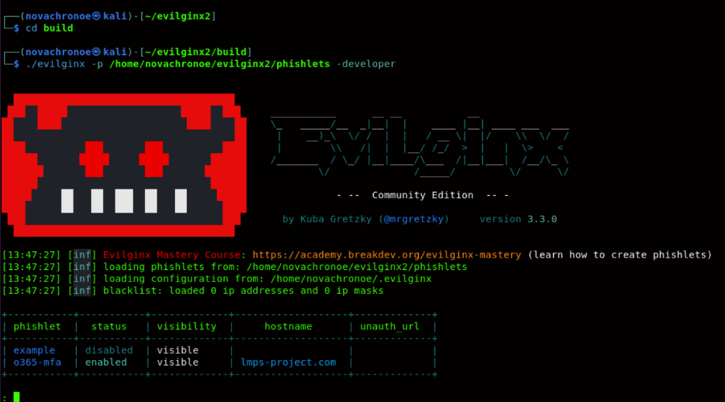

There is no magic without your grimmoire, ours  is the evilginx tool , start it with the following tags
-p                  : specify the path to phishlets directory 
-developper :specify that we want to run evilginx in our local env

This is the first thing you need to set up.
: config domain <domain>
: config ipv4 <IP>
Since we are in local the ip is gonna be 127.0.0.1 and for the domaine you can choose what ever domain you want .
NB: in local mode you don’t need to buy a domain name you can use what ever domain you want yourdomain.com, yet if you want to perform real attacks you need to buy one and ofcrs a legitime one
Here’s how setting things looks in my computer:

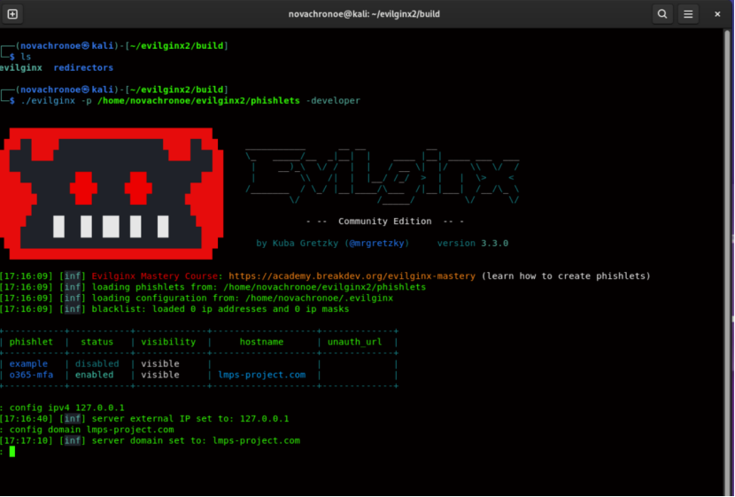

The next step is to set up a hostname for your phishing URL. You can pick whatever hostname you want with as many subdomains as you want, under the condition that it ends with the top-level domain you set up with the config domain.  
Now if you're not running a local development instance (started with -developer command line argument), Evilginx will start to automatically obtain the required TLS certificates from LetsEncrypt
Else :
	self-signed SSL certificate is being used and the browser doesn't trust it.

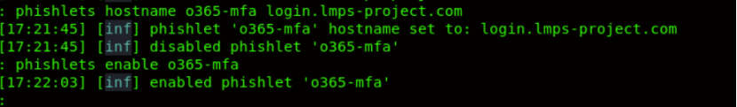

INFO
If you're running Evilginx in developer mode, in your local deployment, you will have to manually modify your /etc/hosts or C:\Windows\System32\drivers\etc\hosts file to be able to map the phishing hostnames to your local IP address.
To make it easier, Evilginx provides a way to generate a list of hosts automatically, which you can copy-paste into your hosts file:
<: phishlets get-hosts linkedin >

The next step is to create a lure. Lures are essentially pre-generated phishing links, which you will be sending out to your target. It has to be assigned to a specific phishlet.To get the lure simply use the following commands:
lures create <phishlet>
Lures
lures get-url <id of the lure for me its 0>
Here’s how things look in my computer

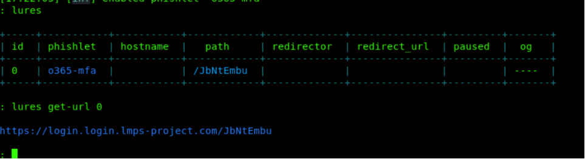

Now I’m gonna use that url or lure to phish my microsoft 365 account , to get the cookie I talked about and have a bypass of my two-factor authentication
After clicking on the url it will direct us the the real microsoft 365
But first you will encouter this problem 

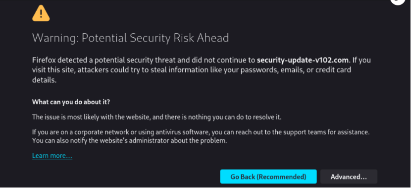

You need to manually configure your browser to trust certificates from Evilginx. To do this, go to the settings and upload the file at the path: /home/kali/.evilginx/crt/ca.crt

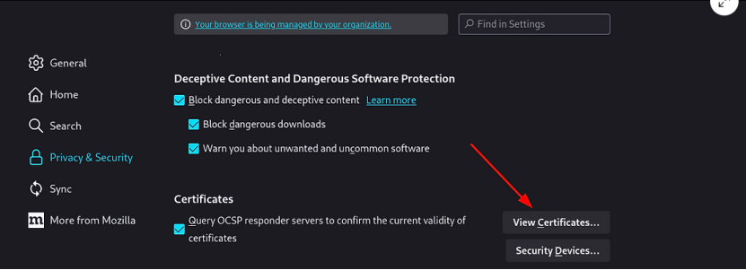

configure or import the certificate and the browser will trust you blindely
NB: this untrust thing will happen only in local mode ,in real life SSL certificates are generated so in the victim machine nothing gonna stop ya

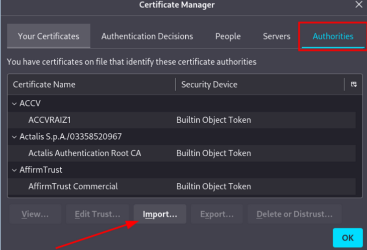

After that, you can reload your phishing page again.

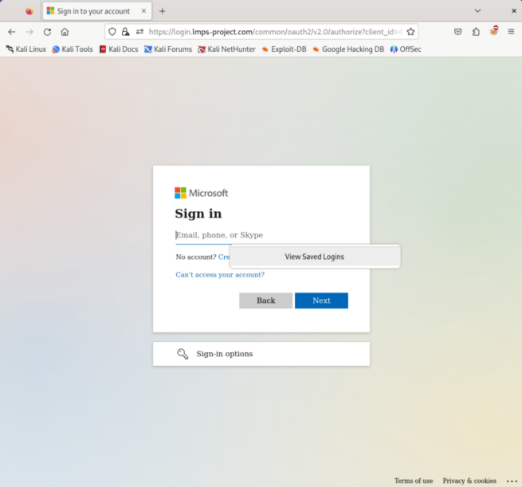

The victim who is (me for now) will enter his creds and do the 2FA (if enabled) to connect to his account , but remember we are in the middle of this connection
So after connecting all the creds and also the cookies are in our hands

Boom we have all the creds and the cookie so we can connect directly to the account, the results will ressemble to something like this

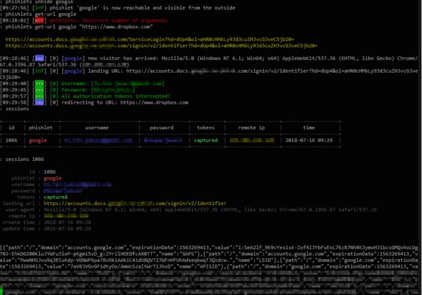

As you can see (or not because I will not put my creds ) we have the cookies ,for now the username and also the pasword does’t even matter , only the cookie its enough to continue our hacking (ethical one ofcrs)
So next step its connecting to target with the cookie and an extention such as cookie editor
 

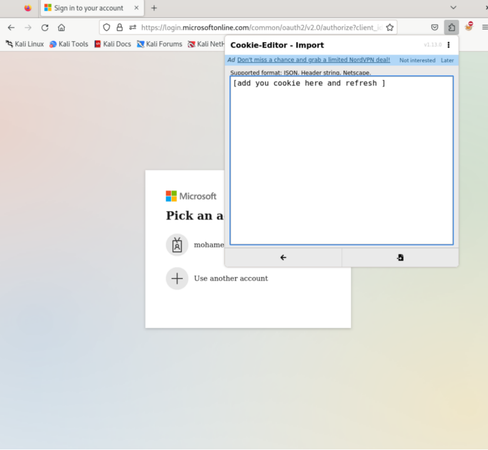 

After adding all the cookie in the import section , refresh and boom you will be directly connected and now and only now you can call yourself a hacker

 ### IV.RESOOURCES
To know more about phishing in general visite this websites:

https://book.hacktricks.xyz/generic-methodologies-and-resources/phishing-methodology

https://tryhackme.com/r/hacktivities (search about phishing room)

To know more about phishing with evilginx visite this :

https://breakdev.org/evilginx-2-next-generation-of-phishing-2fa-tokens/

https://help.evilginx.com/docs/intro

If you want a video walkthrought I will post one soon but while doing that you can watch this video on youtube:

https://www.youtube.com/watch?v=VznqXnNdTyk

NB: this documentation is only for educational purposes , do not try to exercice these types of attacks if not authorized, stay ethical and stay safe because someone is always watching you 

novachronoe

